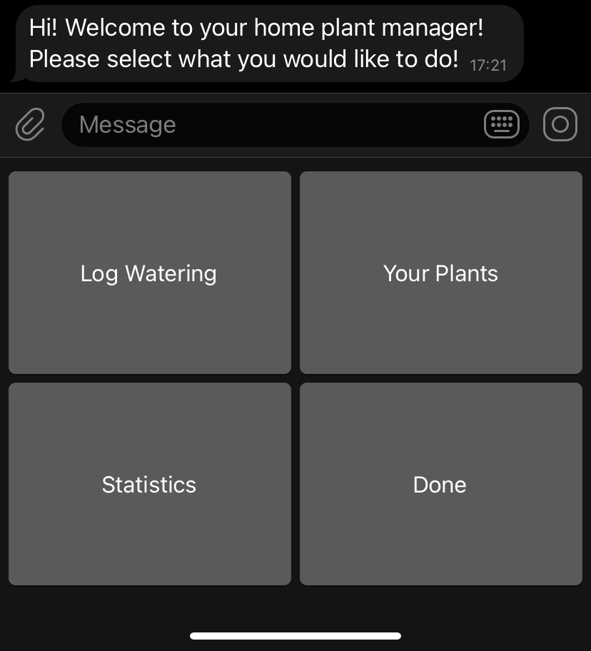
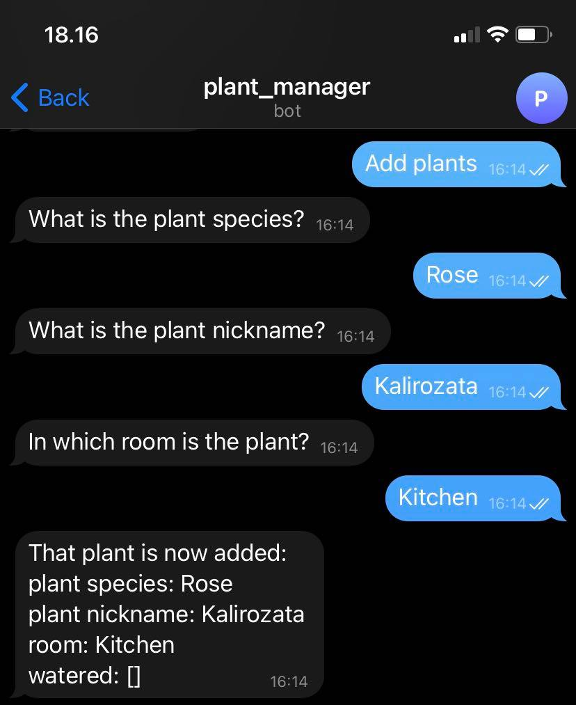

# home_plant_manager
 The home_plant_manager is a RESTful microservice project for keeping track of plant watering, developed by Ivelin Penchev based on personal initiative purely for the purpose of self education in the following topics:
 
 - Microservices development in Python
 - REST API development
 - NoSQL MongoDB for storing information in a database
 - User interaction based on a Telegram bot

The technologies used for this project are:

 - Python
 - Flask 
 - Docker
 - requests
 - json
 - pymongo
 - virtual environments
 - python_telegram_bot
 - batch files .bat
 - git
 - REST

**Disclaimer**: cloning the repository wouldn't be enough for testing the code. You need credentials for the Telegram bot and the MongoDB account. Those credentials must be specified in \telegram_bot\token.json and \data_base\db_credentials.json
 

## Complete description of the system

All communication between the nodes of the home plant manager happens using the REST request/response communication paradigm. 

- The "Catalogue" is a server, which exposes configurations and endpoint locations for the other nodes upon a request. The resources in the scheme of the project are the plants of each user
- The Telegram bot connector is a class, which represents the work flow of the telegram bot. It requests data both from the Catalogue and the MongoDB connector. It then connects to the "plant_manager" bot if you specified the correct telegram token, or to your own bot. You need a valid Telegram bot token in order to use the software, as shown in \telegram_bot\token_example.json
- The MongoDB connector establishes connection with MongoDB's server and performs CRUD operations with the data upon requests from the Telegram bot. You need a valid MongoDB account to use the software, as shown in \data_base\db_credentials_example.json

The project can be built using the following command in the root folder:

    docker-compose up
    
Alternatively, the batch script "start.bat" can be used for running the project once the token.json and db_credentials.json are present.

The current available functionalities are: 

- Add plants (plant species, plant nickname, location of plant)
- List all plants of the user
- Delete plants
- Log that you watered one or more plants today
- Log that you watered one or more plants somewhere in the past (dd/mm/yyyy format)

## User interface screenshots

The following pictures present parts of the user interface.

Starting menu

"Your plants" menu

Result of "Add plant" and user specified plant species, plant nickname, location of plant

Result of "List plants"

"Log watering" menu

 

